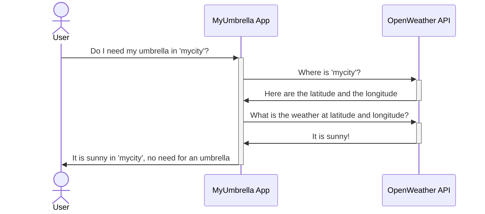

# Umbrella app

This goal of this toy project is to use [FastAPI](https://fastapi.tiangolo.com/) to build a (very) simple API application.
This simple API application is called `MyUmbrella` and allows users to check if an umbrella is needed for a particular city.

**Disclaimer:** While this repo can be used *as is*, the real purpose of this repo is to be used as a basis for discussions with your teammates about software development best practices.

## Architecture and design

### Repository Overview

*Note:* Since I used [VS Code](https://code.visualstudio.com/) to develop `MyUmbrella`, the repository contains two folders that are specific to this IDE and that are not related to the actual application code:

 - `.devcontainer` that contains all the files needed to setup a [development container](https://code.visualstudio.com/docs/devcontainers/containers).
 - `.vscode` that contains the [workspace settings](https://code.visualstudio.com/docs/getstarted/settings#_workspace-settings) for VS Code.

```
☂️ MyUmbrella Repo
┣ 📂 .devcontainer → Contains all the definition files related to the development container
┣ 📂 .vscode → Contains all the settings for VS Code
┣ 📂 maintainer → Contains all the utility scripts for maintenance
┣ 📂 src → Contains the source code for MyUmbrella app
┣ 📂 tests → Contains the tests for MyUmbrella app
┣ 🙈 .gitignore → Defines all the files/directories that should be ignored by git
┣ ⚙️ poetry.lock → Lock file used by Poetry (should not be edited manually!)
┣ 📃 pyproject.toml → Development-related settings for the Python project
┣ 📝 README.md → This readme file
┗ 📃 setup.cfg → Additional settings for development
```

### Code overview

The actual code for `MyUmbrella` application is located inside the `src` directory that contains the main (and only) Python package for the application: `myumbrella`.
This package is structured as follows:

```
📦
┣ 📂 routers → Contains the modules that define the routers to be used by the API app [Depends on FastAPI]
┣ 🐍 app.py → Defines the API application [Depends on FastAPI]
┣ 🐍 core.py → Business entities and logics [No dependencies]
┣ 🐍 dependencies.py → Defines the runtime dependencies needed by the API application [No dependencies]
┣ 🐍 main.py → Main to launch the API application [Depends on FastAPI and Uvicorn]
┗ 🐍 openweather.py → Client for the Openweather API application [Depends on httpx]
```

*Note:* Only the most important files are listed here. This list is just for comprehension, it is not a proper manifest! :smile:


### Runtime Overview

When an users calls `MyUmbrella`, here is the typical sequence of actions:



*Note:* As you can see, `MyUmbrella` relies on the [OpenWeather's API](https://openweathermap.org/) to retrieve the information about the weather.
While this API is free, it requires an API key to be used.

## Running `MyUbrella`

*Important:* No CI/CD nor automatic deployment tools are present in this repo as the main goal of this toy app is to discuss coding practices.

### System requirements

The application needs the following environment to run:

 - [Python](https://www.python.org/) ≥ 3.11
 - [FastAPI](https://fastapi.tiangolo.com/) ≥ 0.91.0
 - [httpx](https://www.python-httpx.org/) ≥ 0.23.3
 - a [ASGI](https://en.wikipedia.org/wiki/Asynchronous_Server_Gateway_Interface) server (like [Uvicorn](https://www.uvicorn.org/) ≥ 0.20.0)

Additionally, `MyUmbrella` also needs an API key to use [OpenWeather's API](https://openweathermap.org/).
You must provide the API to the application using an environment variable named `OPENWEATHER_API_KEY`.
This environment may either contain the actual API key or the path to the file where the API key is stored.

*Note:* For security reasons, using a file is more preferable over storing the API key directly in and environment variable. This is because file content is less likely to be logged compared the environment variable values.

### Launching `MyUmbrella`

You can launch `MyUmbrella` by running the script `main.py` located in the `src/myumbrella` folder. As mentioned earlier, you need to provide an Openweather API key by the means of an environment variable named `OPENWEATHER_API_KEY`. This can be done when calling the script using the CLI:

```bash
OPENWEATHER_API_KEY="/path/to/API.key" python3 src/myumbrella/main.py
```

This will launch an [Uvicorn](https://www.uvicorn.org/) server that will listen to any incoming connections to port 5000.

*Note:* While launching Unicorn for development is fine; for production, you prefer other alternatives like [Gunicorn](https://fastapi.tiangolo.com/deployment/server-workers/) or [containerization](https://fastapi.tiangolo.com/deployment/docker/). This is out of the scope for this toy project. But you will find all the details [here](https://www.uvicorn.org/deployment/) and [there](https://fastapi.tiangolo.com/deployment).

## Contributing

The goal of this (toy) project is not to provide a *real* API application. It is more a glorified "hello world!" application with blows and whistles (TDD, CI/CD, Containerization...). As such, there is no need to contribute on the application features. But any feedback in relation with software development best practices is welcome!